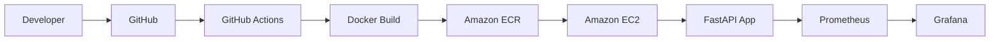

# DeployForge

**An Employee Operations Management REST API, built and shipped with a complete production DevOps pipeline.**

DeployForge is not just a FastAPI service — it's an end-to-end demonstration of how modern applications get from source code to a monitored production environment: containerized with Docker, shipped through an automated GitHub Actions CI/CD pipeline, stored in Amazon ECR, deployed to Amazon EC2, and observed in real time with Prometheus and Grafana.

<p align="left">
  
  
  
  
  
  
  
  
</p>

---

## Architecture



*GitHub Actions builds and publishes the Docker image to Amazon ECR, deploys it to EC2, and Prometheus/Grafana provide observability.*


---

## Table of Contents

- [Project Overview](#project-overview)
- [Key Features](#key-features)
- [Tech Stack](#tech-stack)
- [Repository Structure](#repository-structure)
- [Local Development](#local-development)
- [Dockerization](#dockerization)
- [AWS Infrastructure](#aws-infrastructure)
- [Amazon ECR](#amazon-ecr)
- [IAM and Authentication](#iam-and-authentication)
- [CI/CD Pipeline](#cicd-pipeline)
- [Deployment Flow](#deployment-flow)
- [Production Monitoring](#production-monitoring)
- [Prometheus](#prometheus-verification)
- [Grafana](#grafana)
- [Dashboard](#grafana-dashboard)
- [Security Considerations](#security-considerations)
- [Screenshots](#screenshots)
- [Future Improvements](#future-improvements)
- [Author](#author)

---

## Project Overview

DeployForge is an **Employee Operations Management REST API** built with FastAPI and deployed as a Docker container on AWS EC2. The application itself is intentionally simple — its real purpose is to demonstrate a complete, production-oriented DevOps workflow:

```
Developer → GitHub → GitHub Actions → Docker → Amazon ECR → Amazon EC2 → FastAPI → Prometheus → Grafana
```

This project demonstrates:

- REST API development with FastAPI
- Docker containerization
- Automated CI/CD using GitHub Actions
- Automated Docker image builds
- Amazon ECR as a private container registry
- AWS EC2 as the production deployment environment
- IAM roles for AWS authentication
- GitHub Actions authentication to AWS using OIDC (no long-lived credentials)
- Automated deployment from GitHub Actions to EC2
- Prometheus application metrics
- Grafana monitoring dashboards
- Docker networking between the application and monitoring stack
- Health-check based deployment verification

The goal was not to build a large feature-rich API, but to build a **small, production-grade service and wrap it in the same engineering practices a real DevOps team would use** — automated builds, security scanning, immutable artifacts, safe authentication, and observability.

## Key Features

| Area | What it demonstrates |
|---|---|
| Application | FastAPI REST service with health checks and Prometheus instrumentation |
| Containerization | Lightweight, reproducible Docker image |
| CI | Linting and dependency vulnerability scanning on every push/PR |
| CD | Fully automated build → push → deploy pipeline via GitHub Actions |
| Registry | Immutable, SHA-tagged images in Amazon ECR |
| Compute | Dockerized deployment on Amazon EC2 |
| Auth | Keyless AWS authentication via GitHub Actions OIDC |
| Observability | Prometheus scraping + Grafana dashboards in production |

## Tech Stack

| Category | Technology |
|---|---|
| Language | Python 3.14 |
| Framework | FastAPI |
| Server | Uvicorn |
| Validation | Pydantic |
| Metrics | Prometheus FastAPI Instrumentator, Prometheus Client |
| Linting | Ruff |
| Security Scanning | pip-audit |
| Containerization | Docker, Docker Compose |
| CI/CD | GitHub Actions |
| Container Registry | Amazon ECR |
| Compute | Amazon EC2 |
| Identity | AWS IAM, GitHub Actions OIDC |
| Monitoring | Prometheus |
| Visualization | Grafana |

The FastAPI application exposes the following endpoints:

| Endpoint | Purpose |
|---|---|
| `/` | Root endpoint (returns app version) |
| `/health` | Health check, used by the deployment process to verify the app is up |
| `/employees` | Employee operations |
| `/metrics` | Prometheus metrics endpoint |
| `/docs` | Swagger / OpenAPI documentation |

Metrics are exposed using `prometheus-fastapi-instrumentator`, which means request rate, latency, and runtime metrics are available at `/metrics` **without manually instrumenting every endpoint by hand**. This is what makes it possible for Prometheus to scrape meaningful, application-level data straight out of the box.

The current application version is `1.0.1`, exposed both in the FastAPI metadata and returned by the root endpoint — a small detail, but useful for confirming which build is actually running in production.

## Repository Structure

```text
DeployForge/
├── app/
│   └── main.py
├── prometheus/
│   └── prometheus.yml
├── .github/
│   └── workflows/
│       └── ci.yml
├── Dockerfile
├── docker-compose.yml
├── GrafanaDashboard.json
├── requirements.txt
└── README.md
```

**`app/main.py`** — The FastAPI application: API routes, the health endpoint, employee operations, and Prometheus instrumentation.

**`Dockerfile`** — Builds the production image from `python:3.14-slim`. The application runs with Uvicorn on port `8000`.

**`docker-compose.yml`** — The local development stack: DeployForge API, Prometheus, and Grafana. Locally, Prometheus targets `deployforge:8000`, matching the Docker Compose service name.

**`prometheus/prometheus.yml`** — Prometheus scrape configuration.

**`GrafanaDashboard.json`** — The custom DeployForge API monitoring dashboard, importable directly into Grafana.

**`.github/workflows/ci.yml`** — The GitHub Actions pipeline: validates, builds, pushes, and deploys the application.

## Local Development

Before touching AWS, the application and its monitoring stack were designed to run entirely locally using Docker Compose. This let the whole observability pipeline — app, Prometheus, and Grafana — be validated before anything was deployed to production.

```text
Docker Compose
│
├── DeployForge API   :8000
├── Prometheus        :9090
└── Grafana            :3000
```

Prometheus scrapes `deployforge:8000/metrics`, and Grafana reads its data from Prometheus. Once this loop was confirmed working locally, the same pattern was reproduced in production on EC2.

## Dockerization

The FastAPI application is containerized using a lightweight `python:3.14-slim` base image. The Dockerfile:

1. Starts from `python:3.14-slim`
2. Sets `/app` as the working directory
3. Copies `requirements.txt`
4. Installs dependencies
5. Copies the application code
6. Exposes port `8000`
7. Starts Uvicorn

The container serves the application on `0.0.0.0:8000`.

Containerization matters here for a few concrete reasons:

- **Consistent runtime** — the app behaves the same on a laptop, in CI, and in production.
- **Reproducible deployments** — the same image that passes CI is the exact image that runs on EC2.
- **Easy distribution** — the image moves as a single artifact from CI to ECR to EC2.
- **No environment drift** — no "works on my machine" problem, since the runtime is baked into the image.

## AWS Infrastructure

The production deployment runs entirely in the `ap-south-1` region.

| Resource | Details |
|---|---|
| Compute | Amazon EC2 — `deployforge-server` (`t3.micro`, Ubuntu) |
| Registry | Amazon ECR — `deployforge` repository |
| Identity | IAM roles + GitHub Actions OIDC |
| Networking | EC2 Security Groups |

The application runs on EC2 inside Docker, in a container named `deployforge-api`, and is reachable at:

```text
http://<EC2_PUBLIC_IP>:8000
```

with Swagger docs available at:

```text
http://<EC2_PUBLIC_IP>:8000/docs
```

## Amazon ECR

Docker images are stored in a private Amazon ECR repository named `deployforge`. Each image follows this URI structure:

```text
<ACCOUNT_ID>.dkr.ecr.ap-south-1.amazonaws.com/deployforge:<GIT_SHA>
```

Images are tagged with the Git commit SHA rather than a floating tag like `latest`. This matters in practice:

- Every deployment maps back to an exact Git commit.
- Images are fully traceable — you can always tell what code is running.
- Deployment artifacts are immutable and reproducible.
- Rollbacks and troubleshooting become straightforward, since you can pull the exact prior image by SHA.


<br>

*The `deployforge` ECR repository, showing SHA-tagged images pushed by the CI/CD pipeline.*

## IAM and Authentication

Two separate IAM roles are used, each scoped to a specific purpose:

**EC2 IAM Role — `deployforge-ec2-ecr`**
Allows the EC2 instance to authenticate with Amazon ECR and pull the Docker image, without storing any credentials on the instance itself.

**GitHub Actions IAM Role — `deployforge-github-actions`**
Used by the CI/CD pipeline to authenticate to AWS via **OIDC**, rather than storing long-lived AWS access keys as GitHub Secrets. This is one of the more important security decisions in this project — it removes an entire class of risk (leaked long-lived credentials) from the pipeline.

```text
GitHub Actions
      │
      │ OIDC
      ▼
AWS IAM Role
      │
      ▼
Amazon ECR
```

No credentials, secrets, private keys, AWS access keys, or GitHub secret values are stored in this repository.

## CI/CD Pipeline

The GitHub Actions workflow is triggered on pushes to `main` and on pull requests targeting `main`.

```text
Git Push
   │
   ▼
GitHub Actions
   │
   ├── Checkout
   ├── Setup Python 3.14
   ├── Install dependencies
   ├── Ruff linting
   ├── pip-audit security scan
   ├── Docker build
   ├── AWS authentication using OIDC
   ├── ECR login
   ├── Docker image tagging
   └── Push image to ECR
             │
             ▼
        Deploy Job
             │
             ▼
          EC2
             │
             ├── ECR authentication
             ├── Pull new image
             ├── Stop old container
             ├── Remove old container
             ├── Start new container
             └── Health check
```

The deploy job only runs once the CI job has succeeded, and it always pulls the image tagged with the current commit's SHA — so the exact code that was linted and scanned is the exact code that reaches production.

After the new container starts, the pipeline verifies the deployment with:

```bash
curl --fail http://localhost:8000/health
```

If `/health` responds successfully, the deployment is marked complete. This turns the whole process — from a `git push` to a running, verified production container — into a single automated path.


<br>

*A successful pipeline run showing the CI job, the deploy job, and an overall green status.*

## Deployment Flow

1. Developer pushes code to `main`.
2. GitHub Actions starts automatically.
3. Python dependencies are installed.
4. Ruff performs linting.
5. `pip-audit` checks dependencies for known vulnerabilities.
6. Docker builds the DeployForge image.
7. GitHub Actions authenticates to AWS through OIDC.
8. The image is tagged with the Git commit SHA.
9. The image is pushed to Amazon ECR.
10. The deploy job connects to the EC2 server over SSH.
11. EC2 authenticates with ECR using its IAM role.
12. EC2 pulls the newly built image.
13. The old `deployforge-api` container is stopped and removed.
14. The new container is started.
15. The `/health` endpoint is tested.
16. The deployment is marked successful.


<br>

*`docker ps` output on the EC2 instance, showing `deployforge-api`, `deployforge-prometheus`, and `deployforge-grafana` running side by side.*


<br>

*The deployed FastAPI application, accessible and functional at `/docs`.*

## Production Monitoring

Once the CI/CD pipeline was reliably deploying the application, Prometheus and Grafana were added to the EC2 environment to make the service observable in production, not just "up."

```text
                    AWS EC2
┌─────────────────────────────────────────────┐
│                                             │
│  deployforge-api                            │
│       │                                     │
│       │ /metrics                            │
│       ▼                                     │
│  deployforge-prometheus                     │
│       │                                     │
│       │ Prometheus queries                  │
│       ▼                                     │
│  deployforge-grafana                        │
│                                             │
└─────────────────────────────────────────────┘
```

All three containers share a dedicated Docker network, `deployforge-monitoring`, so Prometheus can reach the application by container name (`deployforge-api:8000`) instead of a hard-coded IP address.

```yaml
global:
  scrape_interval: 15s

scrape_configs:
  - job_name: "deployforge"
    metrics_path: "/metrics"
    static_configs:
      - targets: ["deployforge-api:8000"]
```

This is a small but deliberate difference from the local setup — locally, Prometheus targets `deployforge:8000` because that's the Docker Compose service name; in production, it targets `deployforge-api:8000`, because that's the name of the running container.

## Prometheus Verification

Starting Prometheus isn't the same as confirming it actually works — so the scrape path was explicitly tested from inside the Prometheus container:

```text
http://deployforge-api:8000/metrics
```

The response included metrics such as:

```text
python_gc_objects_collected_total
python_gc_objects_uncollectable_total
```

confirming that the full chain — `Prometheus → Docker network → FastAPI → /metrics` — is functioning end to end. The Prometheus server itself loads its configuration and runs on port `9090`.


## Grafana

Grafana runs as the `deployforge-grafana` container, exposed on port `3000`, with Prometheus configured as its datasource.

Inside the Docker network, the datasource URL is:

```text
http://deployforge-prometheus:9090
```

not `localhost:9090` — inside the Grafana container, `localhost` refers to Grafana itself. Docker's internal DNS is what allows Grafana to resolve and reach the Prometheus container by name.

## Grafana Dashboard

A custom dashboard, **DeployForge - API Overview**, was built to give visibility into:

- Service availability
- Total requests and request rate
- Average, p50, p95, and p99 latency
- Request rate by handler
- Process memory and CPU
- Response size
- Open file descriptors
- Python garbage collection metrics

This is what turns DeployForge from "a deployed API" into an **observable production service** — the difference between knowing the app is running and knowing how it's actually performing.


<br>

*The DeployForge Grafana dashboard under live traffic — service up, request rate, latency, CPU, memory, and per-handler metrics.*

## Docker Production Monitoring Setup

Prometheus and Grafana are deployed in production using a separate monitoring Compose configuration, kept deliberately apart from the local development Compose file so that neither environment disrupts the other.

The monitoring stack consists of the `prometheus` and `grafana` services, both attached to the `deployforge-monitoring` network, with persistent Docker volumes for `prometheus_data` and `grafana_data`.

## Security Considerations

- GitHub Actions authenticates to AWS using **OIDC**, assuming an IAM role instead of using static credentials.
- No long-lived AWS access keys are stored in GitHub Actions secrets.
- EC2 uses an IAM role to authenticate with ECR and pull images.
- Prometheus and Grafana communicate internally over a private Docker network.
- EC2 Security Groups control which ports are externally reachable.
- Dependency vulnerabilities are checked on every pipeline run using `pip-audit`.


## Author

Built as a hands-on demonstration of a complete DevOps lifecycle — development, containerization, CI, security scanning, artifact management, automated deployment, production runtime, and observability.

Feel free to open an issue or reach out if you'd like to discuss the architecture or implementation.
